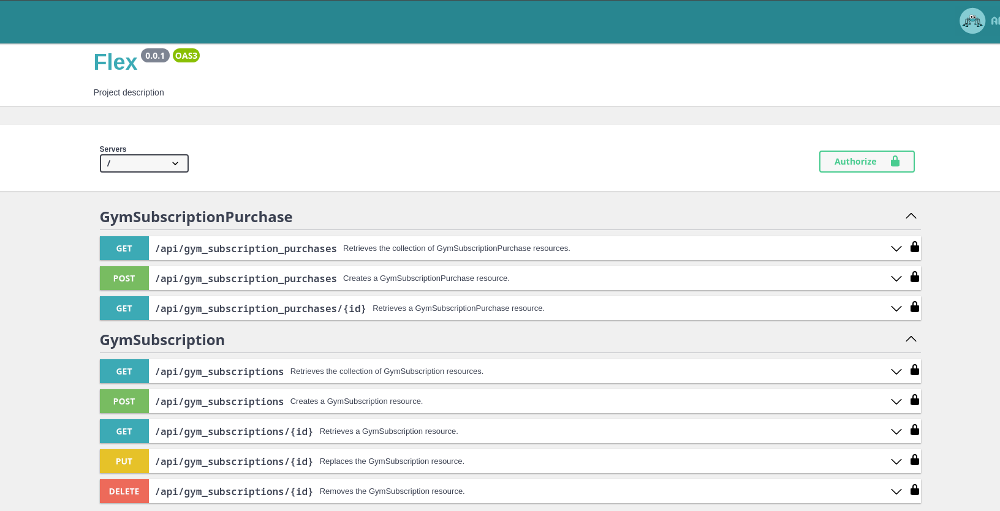

# GymMaster API


Flex is a platform for managing gyms that allows gym owners and trainers to manage their subscription plans, and users to purchase these subscriptions. The project is built using Symfony and API Platform.

## Main Features

- **Gym Management**:
    - Add and edit gym information.
    - Upload and manage gym photos.
    - Create and manage gym subscriptions.

- **Trainer Management**:
    - Add and edit trainer information.
    - Upload a single trainer photo.
    - Create and manage trainer subscriptions.

- **User Management**:
    - User registration and authentication.
    - Role-based access control: Administrator, Gym Admin, Trainer, User.
    - Purchase subscriptions for gym or trainer sessions.

## Technology Stack

- **Backend**: Symfony, API Platform
- **Database**: MySQL/PostgreSQL
- **Authentication**: JWT Token
- **Caching and Queues**: Redis
- **API Documentation**: OpenAPI/Swagger

## Installation

1. Clone the repository:
    ```bash
    git clone https://github.com/amirjonss/flex-api.git
    ```

2. Navigate to the project directory:
    ```bash
    cd flex-api
    ```

3. Run docker containers
    ```bash
    docker compose up -d
    ```

4. Install composer scripts:
    ```bash
    docker compose exec php composer install
    ```

5. To install project run command:
    ```bash
    docker compose exec php bin/console ask:install
    ```

Done! You can open http://localhost:8507/api via browser. By the way, you can change this port by changing DOCKER_NGINX_PORT variable in .env file.
